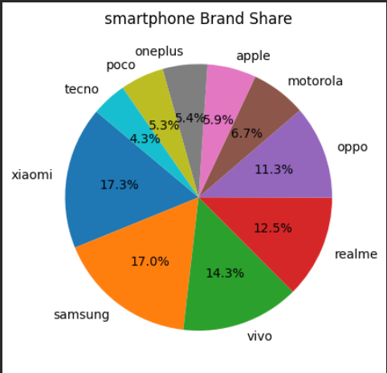
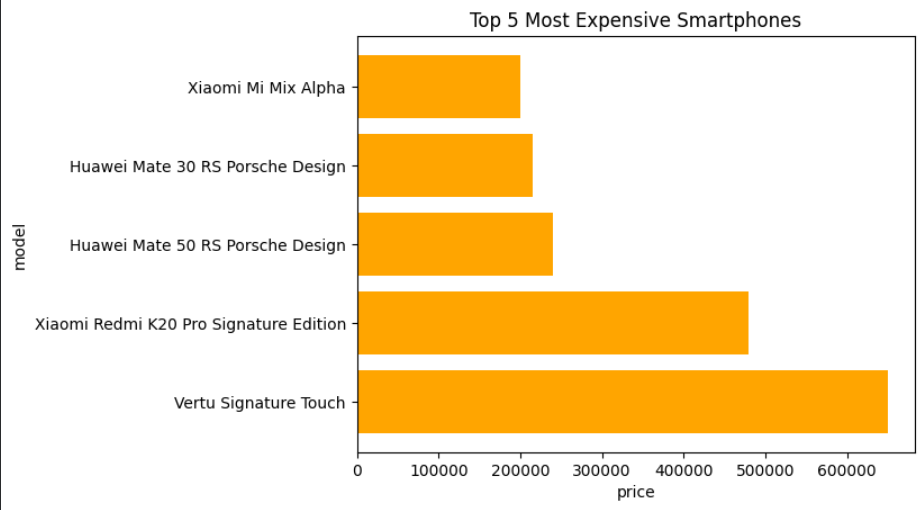

# 📊 Data Analysis Project

## 📌 Overview
This project performs exploratory data analysis using Python in Google Colab.
The dataset was analyzed using Pandas and NumPy, and visualized using Matplotlib to extract meaningful insights.

## 🛠 Technologies Used
- Python
- Pandas
- NumPy
- Matplotlib
- Google Colab

## 📈 Features
- Data cleaning
- Handling missing values
- Statistical analysis
- Data visualization (line chart, bar graph, histogram)

## 📂 Project File
- DataAnalysis.ipynb

## 👨‍💻 Author
Swayam Adatia  
Diploma Graduate in Computer Engineering  
Aspiring Computer Science Student

## 📸 Sample Output

